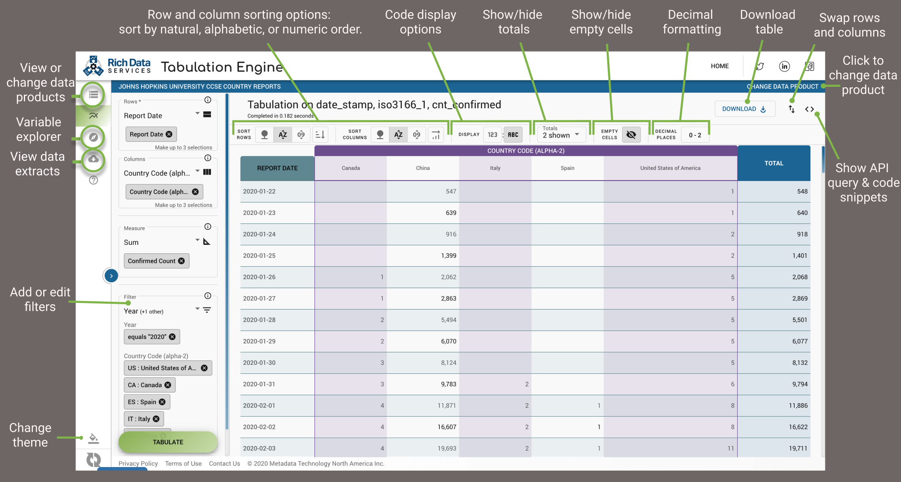
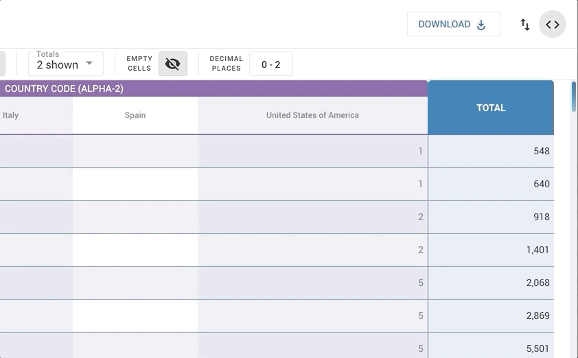
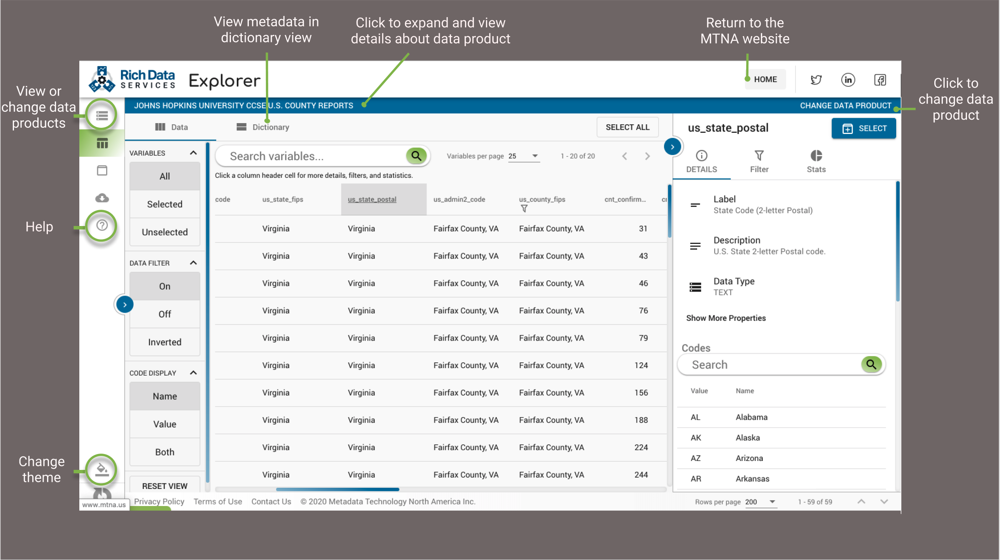

# MTNA/RDS COVID-19 Project

#### _WARNING: THIS PROJECT IS IN EARLY DEVELOPMENT STAGE. CONTENT OR CODE SHOULD ONLY BE USED FOR TESTING OR EVALUATION PURPOSES._

Our COVID-19 project focuses on improving and facilitating access to COVID-19 related data by curating the information and delivering as a through our Rich Data Services API and related web applications. Visit our COVID-19 web site at https://covid19.richdataservices.com/ for more information.

In the process of packaging the data for publication, we are commonly addressing various data quality issues surrounding the various data sources, such as:

- reshaping or reorganizing the data to be better suited for analytical purposes
- enhancing the data by adding variable/fields to faciliate linking and analysis
- rename variables to standardized names to facilitate processing and understanding
- capture metadata and documentation
- repackage the data in open format

The repository holds the various tools we use to harvest and support the above tasks along with resulting new datasets.

## Data Sources

We currently are currently harvesting and compiling data form the following data sources:

- [2019 Novel Coronavirus COVID-19 (2019-nCoV) Data Repository by Johns Hopkins CSSE](data/us/jhu-ccse/README.md)
- [The COVID Tracking Project](https://covidtracking.com/about-project)
- [Government of Canada](https://www.canada.ca/en/public-health/services/diseases/2019-novel-coronavirus-infection.html)
- [Statistics Canada](https://www.statcan.gc.ca/eng/start)
- [New York State Health Data](https://health.data.ny.gov/)
- [Ohio Department of Health](https://coronavirus.ohio.gov/wps/portal/gov/covid-19/dashboards)
- [Tennessee Department of Health](https://www.tn.gov/health/cedep/ncov/data/downloadable-datasets.html)

## Using the Data

We have done the work of gathering and cleaning the data to power our RDS API, but it is open to the public to use however you wish. Below are some ways to interact with the data through our RDS products, which are all currently free to use.

- Use the [Tabulation Engine](https://covid19.richdataservices.com/rds-tabengine/data-product-selection) to create the tabulation you need, then copy the code to use the data in your preferred language.   

- Explore the data and metadata in the [RDS Explorer](https://covid19.richdataservices.com/rds-explorer/data-product-selection).  

- Use our SDKs to integrate the RDS API into your app: 
  - JavaScript ([SDK](https://github.com/mtna/rds-js) + [Example app](https://mtna.github.io/rds-js-examples/covid.html))
  - Python ([SDK](https://github.com/mtna/rds-python) + [Jupyter Notebook](https://github.com/mtna/rds-python-examples))
  - R ([SDK](https://github.com/mtna/rds-r) + [Example app](https://covid19.richdataservices.com/rds-rshiny/covid-19/))
- Visit our [Knowledge Base](https://mtnaus.atlassian.net/wiki/spaces/RDSHD/overview) to learn more, or ask a question at our [service desk](https://mtnaus.atlassian.net/servicedesk/customer/portal/9)--we're happy to help.

## Licensing

The majority of the data undelrying this project is harvested and curated from various sources and is subject to its original licensing where applicable.

Documentation, metadata, and derived data produced by Metadata Technology North America Inc., its partners, and other contributors are made available under a [Creative Commons Attribution 4.0 International License (CC-BY)](https://creativecommons.org/licenses/by/4.0/).

All software, tools, and related scripts/programs available through this Website are, unless otherwise noted, available under an [Apache License Version 2.0](https://www.apache.org/licenses/LICENSE-2.0).

## Citation

While not required, we encourage you and appreciate if you cite any of the underlying source data providers you use for your work as well as our project as:
<pre>Rich Data Services COVID-19 Project, Metadata Technology North America Inc., 2020</pre>

## Terms of Use

This Website, underlying services, and content herein, including all data, metadata, scripts, documentation, and resources, are provided to the public strictly for educational and academic research purposes. The content relies upon publicly available data from multiple sources,that do not always agree. Metadata Technology North America Inc. hereby disclaims any and all representations and warranties with respect to the Website, including accuracy, fitness for use, and merchantability. You are responsible for determining the suitability of this information for your purposes. Reliance on the Website for medical, financial, or other decision making purposes, or the use of the Website for commercial purposes, are strictly prohibited. If you do not agree with these terms, and to our general Website term and privacy policy, you may not access and use this Website.
